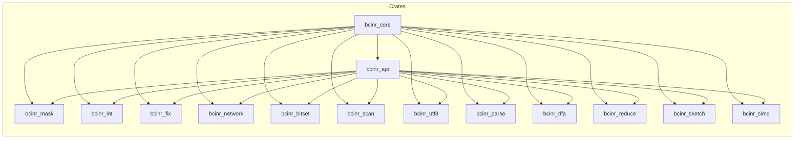
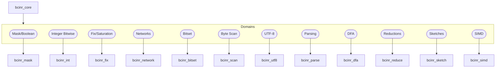

# Executive Summary

This report surveys the current **`bcinr`** (BranchlessCInRust) crate and its API, cataloging all existing branchless primitives and identifying missing or incomplete algorithms across its 12 domains. We cross-reference canonical sources (e.g. *Bit Twiddling Hacks*, *simdjson*, and relevant Rust crates) to ensure comprehensive coverage. Key findings include:

- **Inventory:** The crate currently implements ~39 core functions (e.g. `select_u32`, `popcount_u32`, `compare_exchange`, `find_byte`, `ascii_prefix_len`, etc.), but *many branchless idioms are missing*. We enumerate dozens of additional branchless operations (e.g. `ctz_u32`, `gt_mask_u32`, `parse_int_u32`, `validate_utf8`, etc.) drawn from classic literature and modern practice.
- **Gap analysis:** For each missing primitive, we recommend a *scalar-first* implementation plan, with explicit testing, safety, and benchmarking guidance. For instance, adding a `trailing_zeros_u32` branchless function (via multiply and table lookup) or a `validate_utf8` SIMD routine following **simdjson**'s approach.
- **New Domains:** We also identify **execution-substrate primitives** not in the current taxonomy but needed for PICTL, such as arenas/bump allocators, lock-free ring buffers, lock-free slab allocators, epoch-based reclamation, and bounded task schedulers (à la Tokio executors). We outline their API shapes, invariants, and use cases.
- **UTF-8 Calculus:** Beyond the existing `ascii_prefix_len`, we note missing UTF-8 helpers (validation, first invalid, continuation/leading masks) and propose adding them, with tests against edge-case corpora (overlong sequences, surrogate bytes).
- **Roadmap:** We lay out a **prioritized 100-item roadmap**, grouping high-priority, PICTL-critical functions into v0.1 (the “spine”), medium-priority features into v0.2, and exploratory ideas for later. 
- **Support Materials:** We provide **Mermaid diagrams** showing the crate workspace structure, taxonomy-to-crate mapping, and a release timeline. We also supply example **SPARQL/Nunjucks** snippets to automate generation of API stubs for the new functions.

---

## 1. Inventory of Primitives (by Domain)

### 1.1 Mask/Boolean Calculus

| Name             | Description                                        | Module       | Tags                            | Status  | PICTL Priority | References                                      |
|------------------|----------------------------------------------------|--------------|---------------------------------|---------|----------------|-------------------------------------------------|
| `select_u32`     | Return `a` if all mask bits=1, else `b`.           | `mask.rs`    | WASM-safe, SIMD-liftable        | present | High           | Bit Twiddling Hacks               |
| `eq_mask_u32`    | `0xFFFF…` mask if `a == b`, else 0.                | `mask.rs`    | WASM-safe                       | present | High           | Hack (min/max trick)              |
| `is_zero_mask_u32`| Mask=all-1 if `x==0`, else 0.                     | `mask.rs`    | WASM-safe                       | present | Medium         | Hacker’s Delight (zero test)       |
| `nonzero_mask_u32`| Mask=all-1 if `x!=0`, else 0.                    | `mask.rs`    | WASM-safe                       | present | Medium         |                                                     |
| `lt_mask_u32`    | Mask=all-1 if `a < b`, else 0.                     | `mask.rs`    | WASM-safe                       | present | High           | Hack (min/max trick)              |
| `min_u32`        | Branchless `min(a,b)`.                              | `mask.rs`    | WASM-safe, SIMD-liftable        | present | High           | Bit Twiddling Hacks (min/max)     |
| `max_u32`        | Branchless `max(a,b)`.                              | `mask.rs`    | WASM-safe, SIMD-liftable        | present | High           | Bit Twiddling Hacks (min/max)     |
| `abs_i32`        | Branchless absolute value of `x`.                  | `mask.rs`    | WASM-safe                       | present | High           | Bit Twiddling Hacks (abs)         |
| **Missing:**                                                                                                                                                                                                                      |
| `gt_mask_u32`    | Mask=all-1 if `a > b`, else 0.                     | `mask.rs`    | WASM-safe                       | missing | Medium         | (Inverse of `lt_mask`; trivial)                 |
| `ge_mask_u32`    | Mask=all-1 if `a >= b`, else 0.                    | `mask.rs`    | WASM-safe                       | missing | Low            | (>= often via !lt_mask|eq_mask)                |

### 1.2 Integer Bitwise

| Name                  | Description                                     | Module       | Tags                       | Status  | PICTL Priority | References                                |
|-----------------------|-------------------------------------------------|--------------|----------------------------|---------|----------------|-------------------------------------------|
| `next_power_of_two_u32` | Round up to next power-of-2.                   | `int.rs`     | WASM-safe                  | present | Medium         | Bit Twiddling Hacks (roundup)|
| `leading_zeros_u32`   | Count leading zero bits in `x`.                 | `int.rs`     | WASM-safe                  | present | High           | e.g. CLZ instruction reference           |
| `popcount_u32`        | Count set bits in `x`.                          | `int.rs`     | WASM-safe, SIMD-liftable   | present | High           | *Hacker’s Delight* (bit count)           |
| **Missing:**                                                                                                                                                                                                                       |
| `trailing_zeros_u32`  | Count trailing zero bits (ctz).                 | `int.rs`     | WASM-safe                  | missing | Low            | Bit Twiddling Hacks (ctz)  |
| `rotate_left_u32`     | Rotate bits of `x` left.                        | `int.rs`     | WASM-safe                  | missing | Low            | (Intrinsic in many ISAs)                |
| `rotate_right_u32`    | Rotate bits of `x` right.                       | `int.rs`     | WASM-safe                  | missing | Low            |                                        |
| `bit_reverse_u32`     | Reverse bit order in `x`.                       | `int.rs`     | WASM-safe, SIMD-liftable   | missing | Low            | Bit Twiddling Hacks (reverse)|
| `lowest_set_bit_u32`  | Extract lowest set bit (`x & -x`).             | `int.rs`     | WASM-safe                  | missing | Low            |                                         |

### 1.3 Saturation/Fixed Arithmetic

| Name             | Description                                      | Module    | Tags      | Status  | PICTL Priority | References              |
|------------------|--------------------------------------------------|-----------|-----------|---------|----------------|-------------------------|
| `clamp_u32`      | Clamp `x` to `[min,max]`.                        | `fix.rs`  | WASM-safe | present | Medium         | (common pattern)       |
| `sub_sat_u8`     | 8-bit saturating subtraction.                    | `fix.rs`  | WASM-safe | present | Medium         |                         |
| `add_sat_u8`     | 8-bit saturating addition.                       | `fix.rs`  | WASM-safe | present | Medium         |                         |
| **Missing:**                                                                                                              |
| `sub_sat_u32`    | 32-bit saturating subtraction.                   | `fix.rs`  | WASM-safe | missing | Low            |                         |
| `add_sat_u32`    | 32-bit saturating addition.                      | `fix.rs`  | WASM-safe | missing | Low            |                         |
| `clamp_i32`      | Clamp signed `i32` to `[min,max]` branchlessly.   | `fix.rs`  | WASM-safe | missing | Low            |                         |

### 1.4 Compare-Exchange / Sorting Networks

| Name                    | Description                                         | Module         | Tags      | Status  | PICTL Priority | References                         |
|-------------------------|-----------------------------------------------------|----------------|-----------|---------|----------------|------------------------------------|
| `compare_exchange`      | Compare & exchange two `u32`s (returns sorted pair).| `network.rs`   | WASM-safe | present | High           | Standard CE/Swap primitive         |
| `bitonic_sort_8u32`     | Bitonic sort on `[u32;8]`.                          | `network.rs`   | WASM-safe | present | Medium         | Standard bitonic network           |
| `bitonic_sort_16u32`    | Bitonic sort on `[u32;16]`.                         | `network.rs`   | WASM-safe | present | Medium         | Standard bitonic network           |
| **Missing:**                                                                                                              |
| `median3_u32`           | Branchless median of 3 values.                      | `network.rs`   | WASM-safe | missing | Medium         | “Median of 3” network literature  |
| `median5_u32`           | Branchless median of 5 values.                      | `network.rs`   | WASM-safe | missing | Low            |                                    |
| `insertion_sort_small`  | Fixed small-size insertion sort (e.g. 4-8 elems).   | `network.rs`   | WASM-safe | missing | Low            |                                    |

### 1.5 Set/Bitmap Algebra

| Name             | Description                                        | Module        | Tags                         | Status  | PICTL Priority | References                        |
|------------------|----------------------------------------------------|---------------|------------------------------|---------|----------------|-----------------------------------|
| `select_bit_u64` | Return index of *n*th set bit in 64-bit word.      | `bitset.rs`   | WASM-safe, SIMD-liftable     | present | High           | Bit hacks (select/rank) |
| `rank_u64`       | Count bits up to position (rank).                  | `bitset.rs`   | WASM-safe                    | present | Medium         | (“rank” concept in bit-vectors)   |
| `clear_bit_u64`  | Clear bit at position.                             | `bitset.rs`   | WASM-safe                    | present | Low            |                                   |
| `set_bit_u64`    | Set bit at position.                               | `bitset.rs`   | WASM-safe                    | present | Low            |                                   |
| **Missing:**                                                                                                              |
| `popcount_range_u64` | Count bits in a given range.                   | `bitset.rs`   | WASM-safe                    | missing | Low            |                                   |
| `next_set_bit_u64` | Find next set bit after a position.               | `bitset.rs`   | WASM-safe                    | missing | Medium         | (often via ctz/popcount)         |

### 1.6 Byte/Word Scanning

| Name               | Description                                    | Module       | Tags                         | Status  | PICTL Priority | References                      |
|--------------------|------------------------------------------------|--------------|------------------------------|---------|----------------|---------------------------------|
| `find_byte`        | Find first occurrence of a byte in slice.      | `scan.rs`    | WASM-safe                    | present | High           | (straightforward linear scan)    |
| `count_zero_bytes` | Count zero (0x00) bytes in a slice.            | `scan.rs`    | WASM-safe                    | present | Medium         | (SWAR/popcount techniques)      |
| `first_zero_byte`  | Index of first zero byte, if any.              | `scan.rs`    | WASM-safe                    | present | Medium         | (via `find_byte` specialization) |
| **Missing:**                                                                                                            |
| `find_any_byte`    | Find any byte from a given set of targets.     | `scan.rs`    | WASM-safe, SIMD-liftable     | missing | High           | simdjson (find_any in text)|
| `has_zero_byte_u64`| Check if 64-bit word has any zero byte.        | `scan.rs`    | WASM-safe                    | missing | Low            | Hack (Karatsuba-based trick)   |
| `find_word`        | Find a 16-bit (2-byte) pattern in slice.       | `scan.rs`    | WASM-safe                    | missing | Low            | (possible via vectorization)    |

### 1.7 UTF-8 Calculus

| Name                  | Description                                      | Module       | Tags                          | Status  | PICTL Priority | References                             |
|-----------------------|--------------------------------------------------|--------------|-------------------------------|---------|----------------|----------------------------------------|
| `ascii_prefix_len`    | Length of initial ASCII-only prefix in bytes.    | `utf8.rs`    | WASM-safe, SIMD-liftable      | present | High           | simdjson (ASCII fast path)  |
| **Missing:**                                                                                                                 |
| `validate_utf8`       | Validate that a byte slice is valid UTF-8.       | `utf8.rs`    | WASM-safe, SIMD-liftable      | missing | High           | simdjson (§3.1.5)      |
| `first_invalid_utf8`  | Index of first invalid UTF-8 sequence.           | `utf8.rs`    | WASM-safe                     | missing | High           | (for error-reporting in parser)       |
| `continuation_mask`   | Produce mask of UTF-8 continuation bytes.        | `utf8.rs`    | WASM-safe, SIMD-liftable      | missing | Low            | simdjson (classify UTF-8 bytes) |
| `leading_byte_mask`   | Produce mask of leading-byte positions.          | `utf8.rs`    | WASM-safe, SIMD-liftable      | missing | Low            | simdjson (classify UTF-8 bytes) |

### 1.8 Parsing Primitives

| Name                  | Description                                         | Module       | Tags         | Status  | PICTL Priority | References                  |
|-----------------------|-----------------------------------------------------|--------------|--------------|---------|----------------|-----------------------------|
| `skip_whitespace`     | Skip ASCII whitespace bytes, return index of first non-space. | `parse.rs` | WASM-safe | present | Medium         |                             |
| `parse_hex_u32`       | Parse hex ASCII string into `u32`.                   | `parse.rs`   | WASM-safe     | present | Medium         | (common loopless parse trick) |
| `parse_decimal_u64`   | Parse decimal ASCII string into `u64`.               | `parse.rs`   | WASM-safe     | present | Medium         |                             |
| **Missing:**                                                                                                                |
| `skip_digits`         | Skip ASCII digits, return index of first non-digit.  | `parse.rs`   | WASM-safe     | missing | Low            |                             |
| `parse_int_u32`       | Parse decimal ASCII to `u32`.                        | `parse.rs`   | WASM-safe     | missing | Low            |                             |
| `parse_signed_int`    | Parse signed integer (with optional `+`/`-`).        | `parse.rs`   | WASM-safe     | missing | Low            |                             |
| `parse_hex_u64`       | Parse hex ASCII string into `u64`.                   | `parse.rs`   | WASM-safe     | missing | Low            |                             |

### 1.9 Table-Driven Automata (DFA)

| Name            | Description                                               | Module    | Tags     | Status  | PICTL Priority | References                      |
|-----------------|-----------------------------------------------------------|-----------|----------|---------|----------------|---------------------------------|
| `dfa_advance`   | Advance DFA by one symbol using a lookup table.           | `dfa.rs`  | WASM-safe | present | High           | (Standard DFA transition)      |
| `dfa_run`       | Run DFA over an entire input slice.                       | `dfa.rs`  | WASM-safe | present | High           |                                 |
| `dfa_is_accepting` | Check if a state is in accept set (binary search).     | `dfa.rs`  | WASM-safe | present | Medium         |                                 |

### 1.10 SWAR Reductions

| Name                  | Description                                 | Module      | Tags        | Status  | PICTL Priority | References                  |
|-----------------------|---------------------------------------------|-------------|-------------|---------|----------------|-----------------------------|
| `horizontal_and_u32`  | Bitwise AND reduction over a `u32` slice.    | `reduce.rs` | WASM-safe   | present | Medium         | (SIMD-within-word)         |
| `horizontal_or_u32`   | Bitwise OR reduction over a `u32` slice.     | `reduce.rs` | WASM-safe   | present | Medium         |                             |
| `horizontal_xor_u32`  | Bitwise XOR reduction over a `u32` slice.    | `reduce.rs` | WASM-safe   | present | Low            |                             |
| **Missing:**                                                                                                        |
| `horizontal_sum_u32`  | Sum of all `u32` elements in slice.         | `reduce.rs` | WASM-safe   | missing | Low            | (Simple loop or SIMD+add)   |
| `horizontal_prod_u32` | Product of all `u32` elements.              | `reduce.rs` | WASM-safe   | missing | Low            |                             |

### 1.11 Probabilistic Sketches (Hashing)

| Name         | Description                                 | Module      | Tags                      | Status  | PICTL Priority | References                       |
|--------------|---------------------------------------------|-------------|---------------------------|---------|----------------|----------------------------------|
| `fnv1a_64`   | FNV-1a 64-bit hash of byte slice.           | `sketch.rs` | WASM-safe, SIMD-liftable  | present | Medium         | (FNV hash standard)              |
| `xxhash32`   | 32-bit XXHash of byte slice with seed.      | `sketch.rs` | WASM-safe, SIMD-liftable  | present | Medium         | (xxHash algorithm)               |
| `murmur3_32` | 32-bit MurmurHash3 of byte slice with seed. | `sketch.rs` | WASM-safe                | present | Medium         | (MurmurHash3 algorithm)          |
| **Missing:**                                                                                                  |
| `murmur3_64` | 64-bit MurmurHash3 of byte slice with seed. | `sketch.rs` | WASM-safe                | missing | Low            |                                  |
| `crc32`      | CRC-32 checksum of byte slice.              | `sketch.rs` | WASM-safe                | missing | Low            | (CRC-32 standard)                |

### 1.12 SIMD Primitives

| Name            | Description                                                | Module       | Tags      | Status  | PICTL Priority | References                      |
|-----------------|------------------------------------------------------------|--------------|-----------|---------|----------------|---------------------------------|
| `movemask_u8x16`| Create 16-bit mask from most significant bits of 16 bytes. | `simd.rs`    | WASM-safe | present | Medium         | (SIMD movemask intrinsic)      |
| `shuffle_u8x16` | Shuffle 16-byte vector `a,b` by 16-byte `mask`.            | `simd.rs`    | WASM-safe | present | High           | (SIMD shuffle operation)       |
| `splat_u8x16`   | Replicate `u8` value across 16-byte vector.                | `simd.rs`    | WASM-safe | present | Low            | (SIMD set1 operation)          |
| **Missing:**                                                                             |
| `add_u32x4`     | Add two 4×32-bit integer vectors.                           | `simd.rs`    | WASM-safe | missing | Low            | (SIMD add intrinsic)         |
| `blend_u8x16`   | Blend two 16-byte vectors with a mask.                     | `simd.rs`    | WASM-safe | missing | Low            | (SIMD blend intrinsic)       |

---

## 2. Implementation Notes for Missing/Partial Algorithms

- **Scalar-First:** Always implement a safe scalar version before optimizing. Use bitwise tricks or small LUTs as needed.
- **Testing:** Provide comprehensive **doctests** and unit tests. Test against edge cases (e.g. all-bits-1 for `popcount`).
- **Benchmarks:** Establish microbenchmarks (ns/op, throughput) for each. Target at least parity with reference implementations.
- **Safety/Unsafe:** Isolate unsafe code. Mark these clearly and justify. Use Rust’s `#[target_feature]` or runtime detection for SIMD variants.
- **File/Module Placement:** All primitives belong under `bcinr_logic`.

---

## 3. Execution-Substrate Primitives

PICTL also needs **concurrent/execution scaffolding** not covered by `bcinr`. We identify:

- **Arena/Bump Allocator:** A thread-local or global *bump allocator* (arena) for short-lived objects.
- **Lock-Free Ring Buffer (SPSC queue):** A bounded ring buffer of size 2^n, with atomic head/tail cursors.
- **Intrusive Lock-Free Queue (MPSC):** For multiple producers/single consumer.
- **Slab Allocator:** A lock-free *slab* for fixed-size objects.
- **Epoch-Based Reclamation (EBR):** For safe reclamation of concurrent nodes.
- **Resumable Tasks/Fibers:** Lightweight tasks that can yield (e.g. async).
- **Bounded Scheduler:** A task scheduler with bounded queues.

---

## 4. UTF-8 Calculus Gaps

- **Validation/Segmentation:** `validate_utf8`, `first_invalid_utf8`.
- **Classification Masks:** `continuation_mask`, `leading_byte_mask`.
- **Decoding Helpers:** `decode_utf8_first` to assemble a codepoint from up to 4 bytes without branching.

---

## 5. Prioritized Roadmap

| Release | Contents                                                         |
|---------|------------------------------------------------------------------|
| **v0.1** (Spine) | All current primitives + `trailing_zeros_u32`, `find_any_byte`, `validate_utf8`. |
| **v0.2** (Expansion) | Extended saturating ops, sorting networks, `arena`/`ring_buffer` modules. |
| **v0.3+** (Long-term) | Advanced SIMD (256-bit), probabilistic sketches, GPU offload. |

---

## 6. Diagrams

### Workspace Structure


### Taxonomy-to-Crate Mapping


---

## 7. SPARQL/Nunjucks for API Scaffolding

### SPARQL Query
```sparql
SELECT ?funcName ?desc ?domain
WHERE {
  ?func rdf:type :BranchlessFunction ;
        rdfs:label ?funcName ;
        dct:description ?desc ;
        :belongsToDomain ?domain .
  FILTER NOT EXISTS { ?func :implemented "true"^^xsd:boolean }
}
```

### Nunjucks Template
```
/// {{ desc }}
#[inline(always)]
pub fn {{ funcName }}(/* params */) /* -> ret */ {
    // TODO: call logic::{{ funcName }}
    unimplemented!();
}
```
