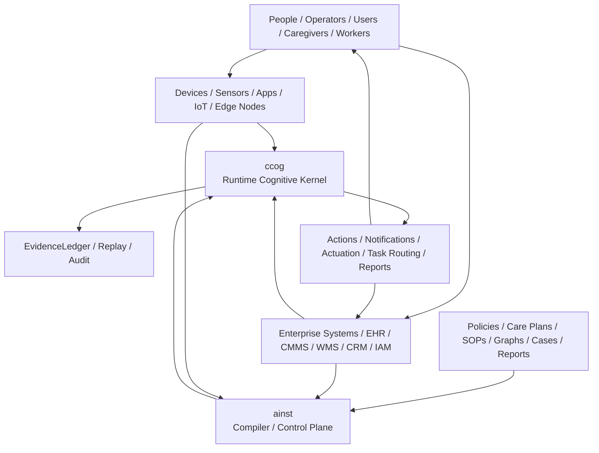
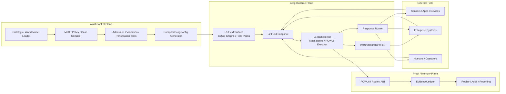
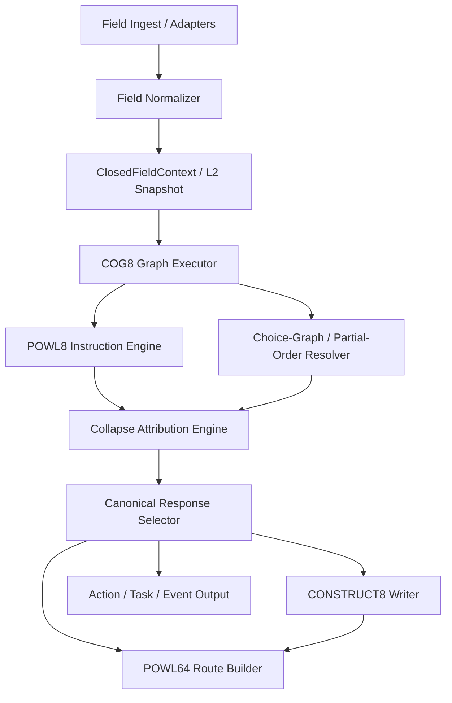
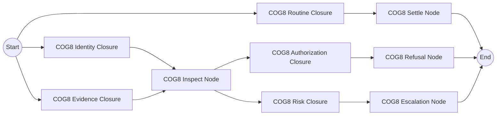

# End-to-End JTBD Architecture: COG8, POWL, and Bounded Closure

**Version:** 1.0 (Canonical)
**Status:** Approved Architecture Pillar
**Core Thesis:** End-to-end JTBD (Jobs to be Done) handling is achieved through graphs of bounded COG8 closures, compiled by `ainst`, executed by `ccog`, and proved by POWL64.

---

## 1. System Context (C4 Level 1)

The stack handles JTBDs end-to-end by moving the complexity "left" into compilation, allowing the runtime kernel to remain a small, deterministic executor of live field state.

---

## 2. Container View (C4 Level 2)

Hard surface separation between manufacturing (Control Plane), execution (Runtime Plane), and proof (Proof Plane) ensures architectural integrity.

---

## 3. Runtime Component View (C4 Level 3)

The internal execution of a JTBD inside `ccog` is a bounded cognitive cycle.

---

## 4. JTBD Meta-Workflow

Every JTBD supported by the architecture follows this end-to-end sequence:

1. **JTBD Definition**: High-level job requirement.
2. **Field / World Modeling**: Identifying the relevant entities and relations.
3. **Closure Variable Selection**: Selecting the minimal set of bits/predicates needed to close the job.
4. **COG8 Decomposition**: Breaking the job into bounded units of 8 triples.
5. **POWL Topology Generation**: Designing the nonlinear routing/loops for the job.
6. **Admission / Perturbation Tests**: Proving the job logic is sensitive to evidence.
7. **CompiledCcogConfig**: Emitting the admitted runtime artifact.
8. **Runtime Field Ingest**: Closing the loop with live data.
9. **L2 Snapshot**: Constructing the unified `ClosedFieldContext`.
10. **COG8 Graph Execution**: Collapsing the field state.
11. **Canonical Response**: Emitting the instinct decision.
12. **CONSTRUCT8 Writeback**: Committing the bounded delta.
13. **POWL64 Proof Route**: Recording the path for replay.

---

## 5. Non-linear Topology

The COG8/POWL topology allows multiple closures to happen independently or converge, handling complex JTBDs without monolithic rules.

---

## 6. End-to-End Checklist

A JTBD is supported if and only if it satisfies these 10 criteria:
- [ ] Explicit Field/World model exists.
- [ ] Closed set of closure variables identified.
- [ ] COG8 decomposition (units of 8) is possible.
- [ ] POWL topology (motion) is defined.
- [ ] Mapped to canonical response lattice.
- [ ] Loop/Inspect/Retrieve requirements are bounded.
- [ ] Writeback fits within CONSTRUCT8.
- [ ] POWL64 route is recordable.
- [ ] EvidenceLedger replay is defined.
- [ ] Action integration is mapped to the external world.
