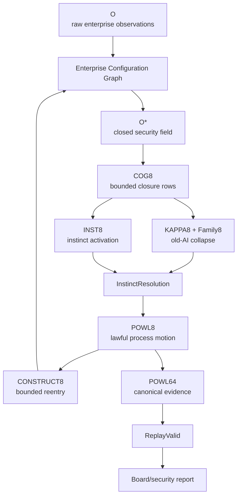
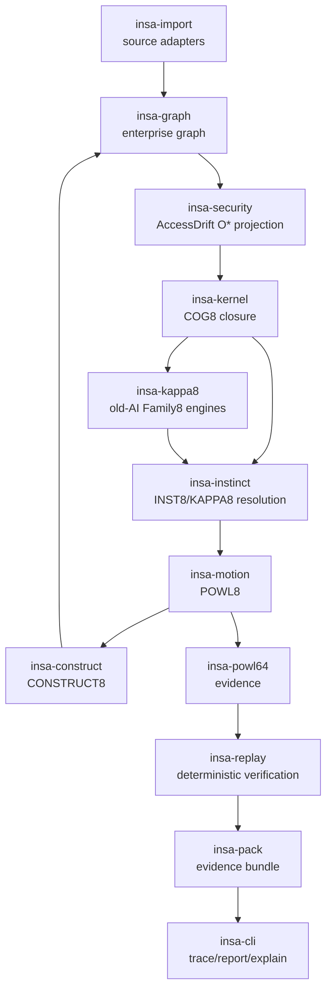
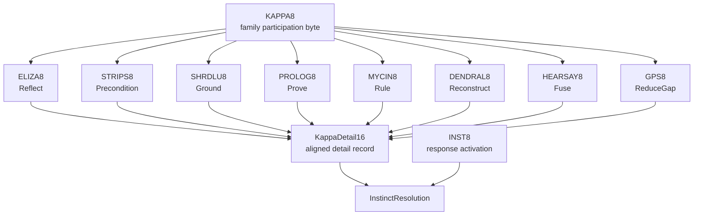
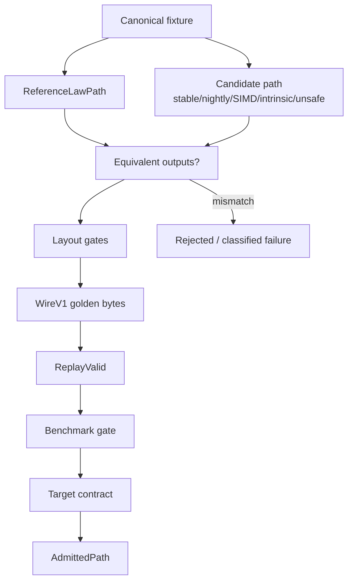
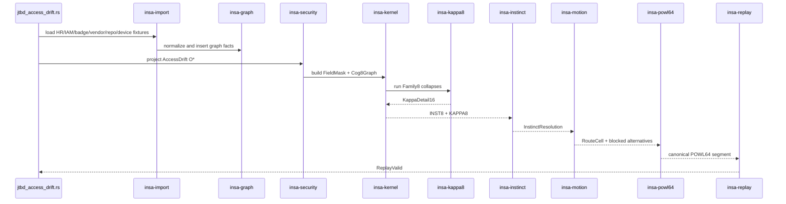

# INSA Security Closure Graph

## PRD / ARD v0.1

[
oxed{
A = \mu(O^*)
}
]

**Product name:** INSA Security Closure Graph
**Product category:** Converged Security Closure / Enterprise Configuration Closure
**First wedge:** Access Drift Closure
**Canonical JTBD:** Terminated contractor still has active badge, VPN, repo, vendor, device, and site access signals.
**Definition of done:** closed field + lawful motion + bounded delta + canonical evidence + deterministic replay.

---

# Part I — PRD

## 1. Product thesis

INSA Security Closure Graph gives boards, CISOs, general counsel, and security leaders the missing layer between fragmented enterprise systems:

[
oxed{
	ext{Security tools see fragments. Graphs see relationships. INSA proves whether the enterprise security field closes.}
}
]

The product does not merely detect alerts, generate summaries, or route tickets.

It determines whether cross-field enterprise conditions are:

```text
closed
not closed
conflicted
stale
missing evidence
unauthorized
blocked
settled
escalated
replayable
```

The first product wedge is **Access Drift Closure**:

> Detect and prove when a person, contractor, vendor identity, badge, account, device, repo, site, or policy state no longer agrees across enterprise systems.

---

## 2. Customer problem

Enterprise security failures increasingly happen in the overlap between systems:

[
HR \cap IAM \cap Badge \cap Vendor \cap Device \cap Repo \cap Site \cap Policy \cap Time
]

Current tools see slices:

| System            | Sees                           |
| ----------------- | ------------------------------ |
| HRIS              | employment status              |
| IAM / SSO / PAM   | digital access                 |
| Badge system      | physical access                |
| MDM / EDR         | device posture                 |
| Repo systems      | source/code access             |
| Vendor management | third-party status             |
| GRC               | controls, policies, exceptions |
| SIEM              | events                         |
| Graph DB          | relationships                  |
| LLM               | context-window analysis        |

But no existing system consistently answers:

```text
Do these fields agree?
Is this access still lawful?
Which evidence is missing?
Which system is authoritative?
Which exception expired?
Which action must be blocked?
Which route was taken?
Can the decision be replayed?
```

Boards receive posture.
INSA gives closure.

---

## 3. Target personas

## Primary buyers

| Persona                    | Pain                                                 |
| -------------------------- | ---------------------------------------------------- |
| Board audit/risk committee | Needs evidence of cybersecurity oversight            |
| CISO / CSO                 | Needs cross-field risk closure, not more alerts      |
| General Counsel            | Needs materiality, evidence, defensibility           |
| Internal Audit             | Needs replayable proof, not narrative reconstruction |
| Chief Risk Officer         | Needs live operational risk coherence                |

## Operational users

| Persona                       | Need                                                |
| ----------------------------- | --------------------------------------------------- |
| IAM team                      | Identify access drift and revoke correctly          |
| Physical security             | Reconcile badge/site anomalies                      |
| Vendor risk                   | Detect third-party access drift                     |
| Security operations           | Triage fewer, better closure failures               |
| Platform/security engineering | Integrate graph + closure into release/access gates |

---

## 4. Product promise

INSA must answer:

```text
What field failed to close?
Which systems contributed evidence?
Which evidence was authoritative?
Which evidence was stale or missing?
Which action was blocked?
Which next motion is lawful?
Which route proves the decision?
Can the route replay deterministically?
```

The board-level promise:

[
oxed{
	ext{No hidden cross-field risk without a closure state, owner, route, and replayable evidence.}
}
]

---

## 5. Product principles

## 5.1 Closure before action

Raw observation (O) cannot directly produce action.

[
O 
ightarrow O^* 
ightarrow \mu(O^*) 
ightarrow A
]

## 5.2 Evidence over narrative

Reports must be derived from POWL64 evidence, not generated prose.

## 5.3 No-at-scale

The system must prevent unnecessary work:

```text
do not route
do not ask
do not escalate
do not approve
do not release
do not investigate
do not create a ticket
```

unless the closure field justifies it.

## 5.4 Byte-shaped cognition

The hot path must use compact admitted byte lanes:

```text
INST8
KAPPA8
ELIZA8
STRIPS8
SHRDLU8
PROLOG8
MYCIN8
DENDRAL8
HEARSAY8
GPS8
POWL8
CONSTRUCT8
```

## 5.5 Vibe done

Done is not “generated,” “compiled,” or “demo works.”

[
oxed{
Done = closed\ field + lawful\ motion + bounded\ delta + canonical\ evidence + deterministic\ replay
}
]

---

# 6. Canonical JTBD

## Access Drift Closure

### Situation

A contractor may have been terminated, but still appears to have:

```text
active badge access
active VPN access
active repo access
active vendor association
recent site entry
device presence on local network
policy requiring removal
```

### Job

When cross-field access drift appears, INSA must:

```text
ground the contractor, badge, accounts, vendor, site, and device
fuse HR/IAM/badge/vendor/repo/device/policy evidence
prove active access after termination
apply badge/vendor/access policy
reconstruct the timeline if needed
reduce the remaining remediation gap
select lawful motion
produce evidence
replay the route
```

### Expected result

```text
AllowAccess is blocked.
RevokeAccess is enabled or escalated.
Evidence is preserved.
A board-ready evidence report is generated from POWL64.
Replay returns ReplayValid.
```

---

# 7. Functional requirements

## FR1 — Source ingestion

INSA must ingest normalized observations from:

```text
HRIS
IAM / SSO / PAM
badge system
repo system
device / MDM / EDR
vendor management
policy / GRC
site/security logs
```

Each observation must carry:

```text
source_id
source_authority
timestamp
policy_epoch
object reference
digest
freshness
```

---

## FR2 — Enterprise configuration graph

INSA must build a graph containing:

```text
Person
Vendor
Contract
Badge
Account
Device
Site
Zone
Repo
Application
Policy
Exception
CVE
Incident
EvidenceSource
Route
```

Example relationships:

```text
Person belongs_to Vendor
Person has Badge
Badge grants_access_to Site
Person owns Account
Account grants_access_to Repo
Device observed_at Site
Vendor governed_by Contract
Policy governs Access
Exception modifies Policy
```

---

## FR3 — O* projection

INSA must project raw graph facts into closed field contexts.

For Access Drift:

```text
identity_terminated
vendor_contract_expired
badge_active
vpn_active
repo_access_active
recent_site_entry
device_seen_on_site_network
policy_requires_access_removal
```

These become typed field bits.

---

## FR4 — COG8 closure

Each COG8 row must have support width ≤ 8.

A COG8 row evaluates:

```text
required_mask
forbidden_mask
completed_block_mask
emits_inst8
emits_kappa8
priority
flags
```

If a closure needs 9 fields:

[
Need9 \Rightarrow Decompose
]

not widen.

---

## FR5 — KAPPA8 old-AI collapse

KAPPA8 identifies which cognitive family participated:

| Bit | KAPPA family          |
| --: | --------------------- |
|   0 | Reflect / ELIZA       |
|   1 | Precondition / STRIPS |
|   2 | Ground / SHRDLU       |
|   3 | Prove / Prolog        |
|   4 | Rule / MYCIN          |
|   5 | Reconstruct / DENDRAL |
|   6 | Fuse / HEARSAY-II     |
|   7 | ReduceGap / GPS       |

Each KAPPA family must have its own internal byte:

```text
ELIZA8
STRIPS8
SHRDLU8
PROLOG8
MYCIN8
DENDRAL8
HEARSAY8
GPS8
```

---

## FR6 — INST8 response activation

INST8 represents active instincts:

| Bit | Instinct |
| --: | -------- |
|   0 | Settle   |
|   1 | Retrieve |
|   2 | Inspect  |
|   3 | Ask      |
|   4 | Await    |
|   5 | Refuse   |
|   6 | Escalate |
|   7 | Ignore   |

Activation may be many.

Selection must be one-hot.

---

## FR7 — InstinctResolution

The system must convert active INST8 into:

```text
selected_instinct
inhibited_alternatives
conflict_status
resolution_class
```

A selected instinct must be:

[
0 \lor onehot(x)
]

---

## FR8 — POWL8 lawful motion

POWL8 must represent bounded process motion:

```text
ACT
CHOICE
PARTIAL
JOIN
LOOP
SILENT
BLOCK
EMIT
```

POWL8 must prevent:

```text
deadlock
livelock
unsound completion
unproofed emission
silent stuck state
unbounded retry
```

Every state must resolve into:

```text
progress
bounded wait
lawful block
lawful silent transition
proofed emission
escalation
settlement
```

---

## FR9 — CONSTRUCT8 bounded reentry

External results do not become authority.

They must re-enter as:

[
Observation 
ightarrow Validate 
ightarrow CONSTRUCT8 
ightarrow O^*
]

Each CONSTRUCT8 delta must contain ≤ 8 typed entries.

---

## FR10 — POWL64 evidence

Every meaningful route must emit canonical evidence:

```text
RouteCell
Cog8FiringRecord
BlockedAlternative
Checkpoint
PolicyEpoch
DictionaryDigest
ConfigDigest
WireV1 bytes
ReplayVerdict
```

Evidence must include blocked alternatives:

```text
AllowAccess blocked
SettleCase blocked
EmitWithoutProof blocked
```

---

## FR11 — Replay

The system must replay POWL64 evidence and return:

```text
ReplayValid
ReplayInvalid(reason)
```

Replay must verify:

```text
same inputs
same policy epoch
same dictionary/config digest
same route cells
same blocked alternatives
same final decision
```

---

## FR12 — Board report

The board/security report must be derived from evidence.

It must answer:

```text
what failed to close
what was blocked
what was missing
what was escalated
what was settled
what evidence supports it
whether replay is valid
```

No narrative-only report is acceptable.

---

# 8. Non-functional requirements

## NFR1 — Hot path zero allocation

COG8/KAPPA8/INST8/POWL8 hot path must avoid heap allocation.

## NFR2 — Byte-level layout gates

Hot structs must have:

```text
size_of gates
align_of gates
offset gates
reserved byte rules
```

## NFR3 — Canonical wire encoding

No raw transmute into `.powl64`.

WireV1 must use explicit encoding and decoding.

## NFR4 — Golden fixtures

Canonical bytes must be tested with golden fixtures.

## NFR5 — Cross-platform encoding stability

WireV1 must be stable across target platforms.

## NFR6 — ReferenceLawPath equivalence

Fast paths must equal ReferenceLawPath:

[
ReferenceLaw(x) = CandidatePath(x)
]

## NFR7 — Revocable admission

Admitted paths can become unadmitted after:

```text
compiler change
CPU target change
benchmark regression
replay divergence
semantic change
```

---

# 9. Success metrics

## Technical metrics

```text
Access Drift JTBD passes end-to-end
ReplayValid for generated POWL64 segment
zero allocations in hot path
layout gates pass
golden WireV1 tests pass
compile-fail tests pass
benchmark smoke passes
```

## Product metrics

```text
number of cross-field closure failures found
number of terminated-but-active identities detected
number of expired-vendor active accesses detected
number of stale exceptions detected
number of false-positive alerts suppressed
time to generate board-ready evidence
percentage of findings with ReplayValid
```

## Board metrics

```text
closure failures by domain
blocked unlawful motions
open evidence gaps
active escalations
replay-valid evidence packs
material incident route readiness
```

---

# Part II — ARD

## 1. Architecture overview



---

## 2. Workspace architecture

```text
insa/
  crates/
    insa-types
    insa-instinct
    insa-kappa8
    insa-kernel
    insa-motion
    insa-construct
    insa-powl64
    insa-replay
    insa-pack
    insa-graph
    insa-security
    insa-import
    insa-truthforge
    insa-cli
    xtask
  ontology/
    insa.ttl
    shapes.ttl
    vocab/
      inst8.ttl
      kappa8.ttl
      powl8.ttl
  testdata/
    cases/
      access_drift/
    golden/
      wire/
      graph/
    fuzz-seeds/
  benches/
  docs/
```

---

## 3. Crate responsibilities

| Crate             | Responsibility                            |
| ----------------- | ----------------------------------------- |
| `insa-types`      | IDs, masks, field bits, digests, epochs   |
| `insa-instinct`   | INST8, KAPPA8, Family8 bytes, resolution  |
| `insa-kappa8`     | old-AI engines                            |
| `insa-kernel`     | COG8 row evaluation                       |
| `insa-motion`     | POWL8 route typestate                     |
| `insa-construct`  | CONSTRUCT8 bounded deltas                 |
| `insa-powl64`     | evidence layout and WireV1 encoding       |
| `insa-replay`     | deterministic replay                      |
| `insa-pack`       | bundle evidence packs                     |
| `insa-graph`      | enterprise configuration graph            |
| `insa-security`   | Access Drift and security-domain closures |
| `insa-import`     | source adapters                           |
| `insa-truthforge` | admission, equivalence, falsification     |
| `insa-cli`        | operator/developer commands               |
| `xtask`           | DX/QOL automation                         |

---

## 4. Core architecture diagram



---

## 5. Old-AI Family8 architecture



---

## 6. Access Drift field bits

Initial COG8 support:

| Bit | Field                            |
| --: | -------------------------------- |
|   0 | `identity_terminated`            |
|   1 | `vendor_contract_expired`        |
|   2 | `badge_active`                   |
|   3 | `vpn_active`                     |
|   4 | `repo_access_active`             |
|   5 | `recent_site_entry`              |
|   6 | `device_seen_on_site_network`    |
|   7 | `policy_requires_access_removal` |

This is the first canonical `AccessDrift8` closure surface.

---

## 7. KAPPA family byte definitions

## ELIZA8

```text
MirrorIntent
RestateClaim
DetectAffect
DetectAmbiguity
DetectMissingSlot
AskClarifying
SlowPrematureAction
DeferToClosure
```

## STRIPS8

```text
PreconditionsSatisfied
MissingRequired
ForbiddenPresent
EffectsKnown
EffectsConflict
ActionEnabled
ActionBlocked
RequiresReplan
```

## SHRDLU8

```text
SymbolResolved
ObjectUnique
AliasMatched
ContextDisambiguated
AmbiguousReference
MissingObject
AuthorityMismatch
GroundingFailed
```

## PROLOG8

```text
GoalProved
GoalFailed
FactMissing
RuleMatched
ContradictionFound
DepthExhausted
CycleDetected
ProofRequiresEscalation
```

## MYCIN8

```text
RuleMatched
RuleFired
RuleConflict
ConfidenceHigh
ConfidenceLow
PolicyEpochValid
PolicyEpochStale
ExpertReviewRequired
```

## DENDRAL8

```text
FragmentsSufficient
CandidateGenerated
CandidatePruned
UniqueReconstruction
MultipleReconstructions
MissingFragment
ConstraintViolation
ReconstructionUnstable
```

## HEARSAY8

```text
SourceAgrees
SourceConflicts
SourceMissing
SourceStale
SourceAuthoritative
SourceWeak
FusionComplete
FusionRequiresInspection
```

## GPS8

```text
GoalKnown
GapDetected
GapSmall
GapLarge
OperatorAvailable
OperatorBlocked
ProgressMade
NoProgress
```

---

## 8. Rust data model sketch

```rust
#[repr(transparent)]
pub struct InstinctByte(pub u8);

#[repr(transparent)]
pub struct KappaByte(pub u8);

#[repr(transparent)]
pub struct ElizaByte(pub u8);

#[repr(transparent)]
pub struct StripsByte(pub u8);

#[repr(transparent)]
pub struct ShrdluByte(pub u8);

#[repr(transparent)]
pub struct PrologByte(pub u8);

#[repr(transparent)]
pub struct MycinByte(pub u8);

#[repr(transparent)]
pub struct DendralByte(pub u8);

#[repr(transparent)]
pub struct HearsayByte(pub u8);

#[repr(transparent)]
pub struct GpsByte(pub u8);
```

Aligned detail record:

```rust
#[repr(C, align(16))]
pub struct KappaDetail16 {
    pub kappa: KappaByte,
    pub eliza: ElizaByte,
    pub strips: StripsByte,
    pub shrdlu: ShrdluByte,
    pub prolog: PrologByte,
    pub mycin: MycinByte,
    pub dendral: DendralByte,
    pub hearsay: HearsayByte,
    pub gps: GpsByte,
    pub reserved: [u8; 7],
}
```

---

## 9. Core route typestate

```rust
pub struct Route<State> {
    inner: RouteInner,
    _state: core::marker::PhantomData<State>,
}

pub enum Unproofed {}
pub enum Proofed {}

impl Route<Unproofed> {
    pub fn prove(self, ctx: ProofCtx) -> Result<Route<Proofed>, ProofError> {
        todo!()
    }
}

impl Route<Proofed> {
    pub fn emit(self) -> EmittedRoute {
        todo!()
    }
}
```

Impossible path:

```text
Route<Unproofed> -> emit()
```

must fail at compile time.

---

## 10. Admission architecture



Nightly, SIMD, intrinsics, and unsafe are not “better” by default.

[
oxed{
	ext{Best} = 	ext{admitted control}
}
]

---

## 11. WireV1 rules

WireV1 must enforce:

```text
explicit endianness
no raw transmute
invalid enum discriminants rejected
reserved bytes zero on write
reserved bytes version-policy checked on read
decode(encode(x)) = x
encode(decode(bytes)) = canonical(bytes)
golden fixtures
cross-platform verification
```

---

## 12. CLI / DX requirements

Required commands:

```bash
cargo xtask doctor
cargo xtask dx
cargo xtask layout
cargo xtask golden verify
cargo xtask replay access-drift
cargo xtask truthforge access-drift

insa explain-byte inst8 0b01100010
insa explain-byte kappa8 0b01011100
insa trace access-drift --fixture terminated-contractor
```

`cargo xtask dx` must run:

```text
fmt
clippy
unit tests
property tests
compile-fail tests
golden wire tests
replay tests
layout gates
access-drift JTBD
bench smoke
```

---

# 13. JTBD acceptance test

## End-to-end test flow



---

## Acceptance criteria

The Access Drift JTBD passes only if:

```text
source fixtures load deterministically
graph projection produces expected AccessDrift O*
COG8 rows fire deterministically
all expected KAPPA families emit expected Family8 bytes
INST8 emits Refuse + Inspect + Escalate/Retrieve
selected instinct is one-hot
POWL8 blocks AllowAccess
POWL8 enables or escalates RevokeAccess
POWL64 segment is written with canonical WireV1
golden bytes match
ReplayValid returns true
board report derives from evidence
```

---

# 14. Milestones

## M0 — Byte/domain foundations

```text
insa-types
INST8
KAPPA8
Family8 byte types
SelectedInstinctByte
FieldMask / RequiredMask / ForbiddenMask
layout gates
```

## M1 — Access Drift O*

```text
source fixtures
enterprise graph
AccessDrift8 field projection
COG8 rows
```

## M2 — KAPPA engines

```text
SHRDLU8
STRIPS8
PROLOG8
HEARSAY8
GPS8
MYCIN8
DENDRAL8
ELIZA8
```

## M3 — Motion/proof

```text
InstinctResolution
POWL8
Route typestate
CONSTRUCT8
POWL64 WireV1
Replay
```

## M4 — Truthforge/DX

```text
xtask dx
truthforge access-drift
golden verify
trace command
explain-byte command
bench smoke
```

## M5 — Board report

```text
evidence-derived report
blocked alternatives
open gaps
escalations
settled risks
ReplayValid proof
```

---

# 15. Definition of Done

The project is done when the runtime, tests, evidence pack, replay engine, CLI, and board report agree.

[
oxed{
Done = closed\ field + lawful\ motion + bounded\ delta + canonical\ evidence + deterministic\ replay
}
]

For MVP, done means:

```text
Access Drift Closure works end to end.
No unproofed emission is possible.
No Family8 engine is unbounded.
No WireV1 format is implicit.
No report is generated without evidence.
No fast path is admitted without ReferenceLawPath equivalence.
No closure support widens past 8 without decomposition.
```

---

# 16. Final PRD/ARD summary

[
oxed{
INSA Security Closure Graph is a board-grade enterprise security closure system.
}
]

It converts:

[
O 
ightarrow O^* 
ightarrow \mu(O^*) 
ightarrow A
]

through:

```text
graph-backed enterprise context
COG8 bounded closure
KAPPA8 old-AI collapse
Family8 detail bytes
INST8 instinct activation
POWL8 lawful motion
CONSTRUCT8 bounded reentry
POWL64 canonical evidence
ReplayValid verification
```

The first proof point is **Access Drift Closure**.

The strategic product claim:

[
oxed{
INSA proves whether the enterprise security field closes before action moves.
}
]
