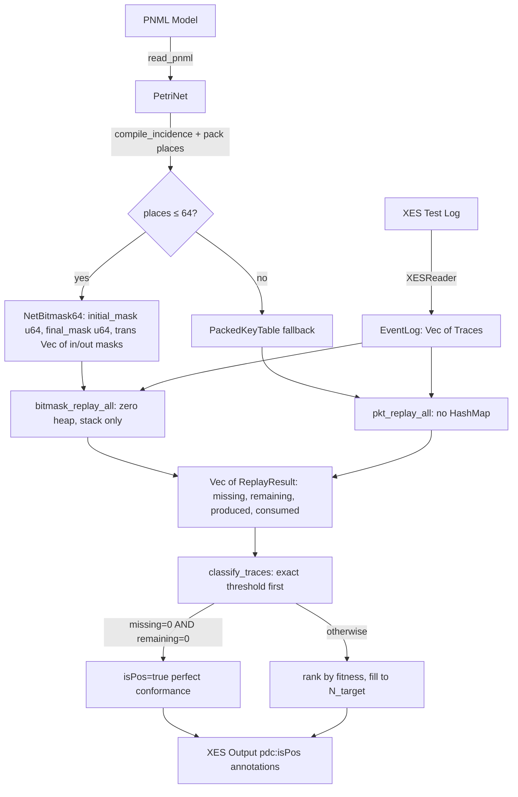
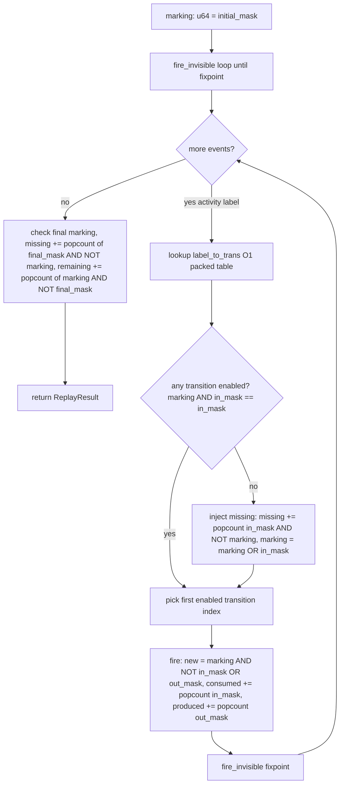
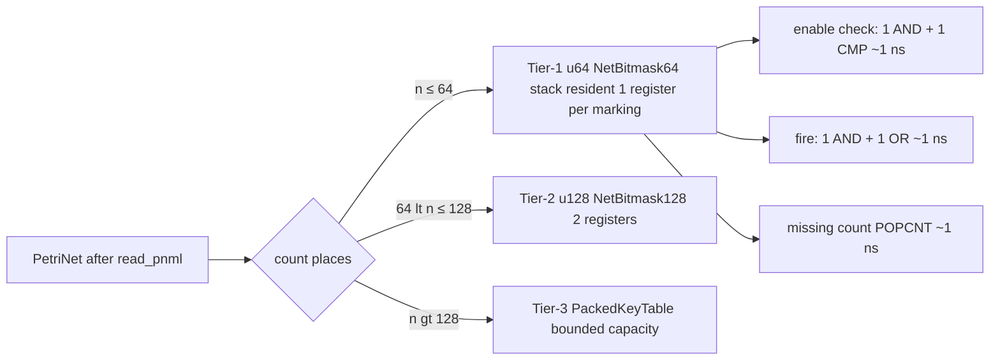
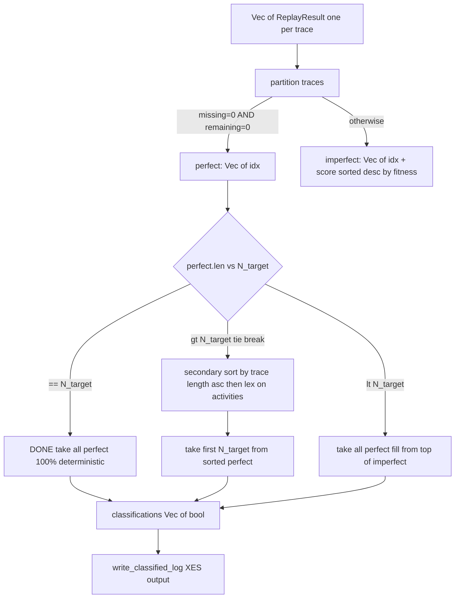

# 04 — Mermaid Architecture Diagrams

Four diagrams rendered to validate the planned bitmask-replay architecture.

## 1. Overall PDC 2025 pipeline

## 2. Bitmask token replay hot loop

## 3. Two-tier net dispatch

## 4. Deterministic classification logic

