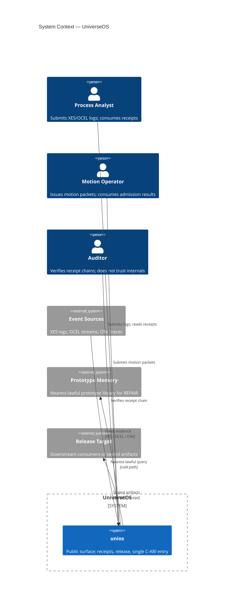
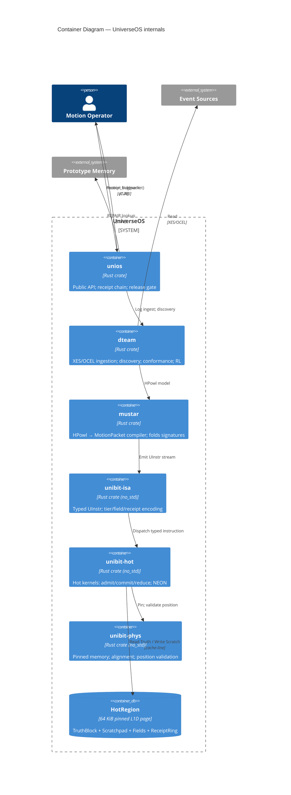
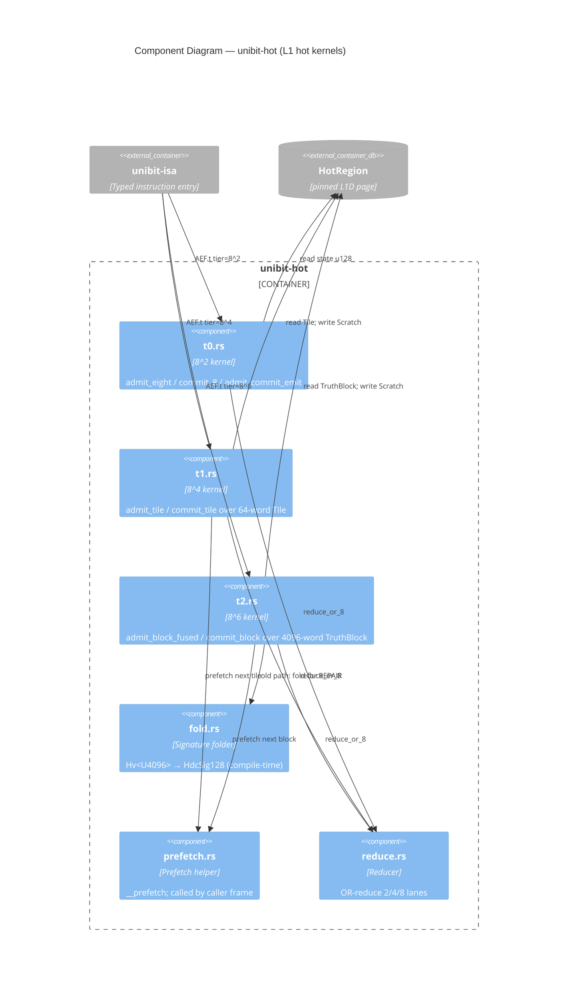
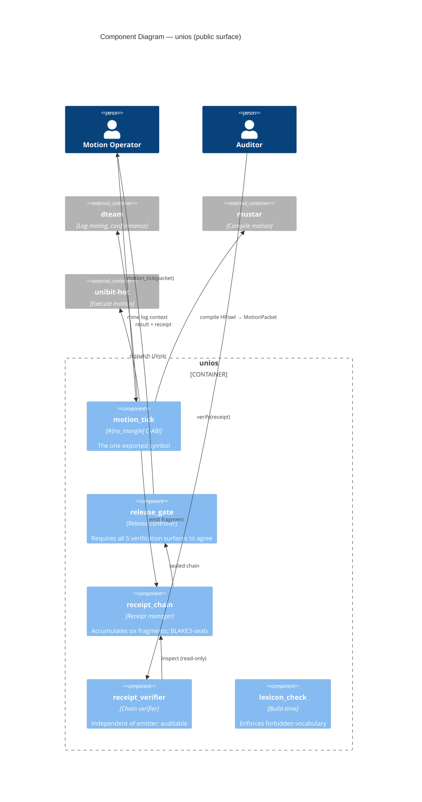
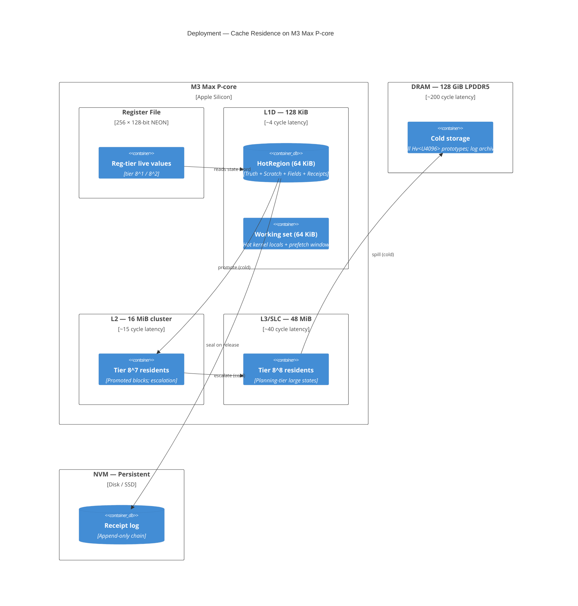
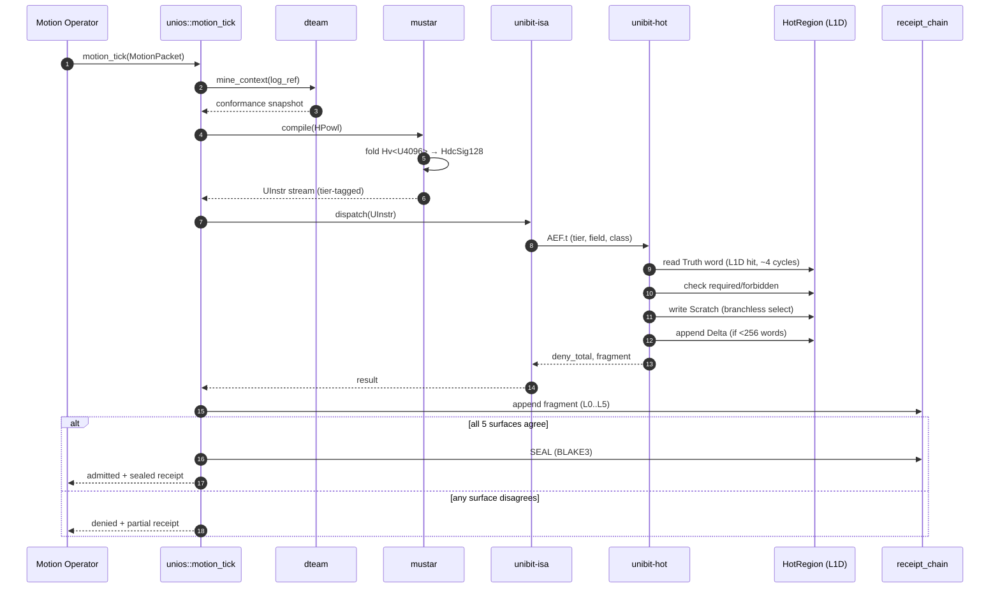
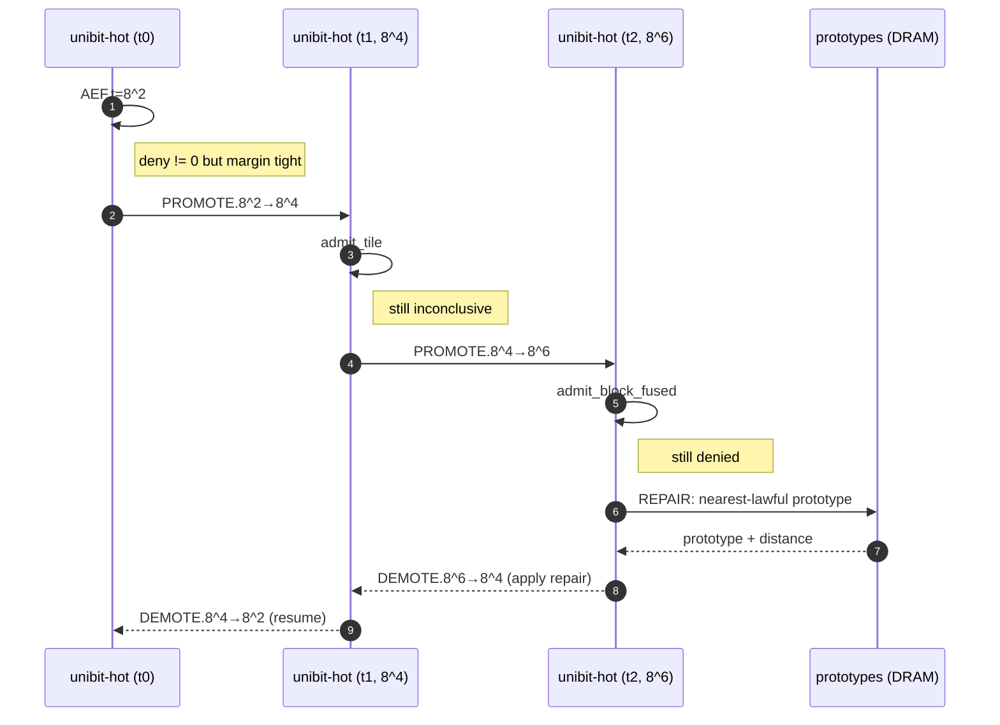

# 41 — C4 Diagrams: UniverseOS / unibit / dteam / unios

## C4 model recap

```
L1 Context    — systems and users surrounding the thing
L2 Container  — runtime deployables inside the thing
L3 Component  — modules inside a container
L4 Code       — classes/functions inside a component (omitted; lives in code)
```

All diagrams are Mermaid C4. Render with `@mermaid-js/mermaid-cli` or any
C4-aware tool.

---

## C4-L1 — System Context



**Read it as:** analysts, operators, and auditors interact with a single
system (unios). Everything below unios is invisible from outside. Event
sources feed in; prototypes are consulted only on the cold path; release
targets receive sealed artifacts.

---

## C4-L2 — Container Diagram



**Layering law:** each arrow crosses exactly one layer boundary. No
arrow skips. `unios` never reaches into `unibit-hot`; `dteam` never
reaches into `unibit-phys`.

---

## C4-L3a — Component Diagram: unibit-hot



**Tier discipline:** t0 handles 8¹/8² (register-resident), t1 handles
8³/8⁴/8⁵ (tile-resident), t2 handles 8⁶ (block-resident). The
`fold.rs` helper is cold — only entered on escalation.

---

## C4-L3b — Component Diagram: unios (public surface)



**Public surface rule:** every external caller touches only `motion_tick`
or `verify`. Nothing else in unios is exported.

---

## C4-L3c — Component Diagram: HotRegion Layout (data view)

```mermaid
C4Component
    title HotRegion Layout — 64 KiB pinned L1D page

    Container_Boundary(hot_region, "HotRegion (align 4096, pinned, mlocked)") {
        ComponentDb(truth, "TruthBlock", "offset 0, 32 KiB", "4,096 × u64 — what is")
        ComponentDb(scratch, "Scratchpad", "offset 32,768, 32 KiB", "4,096 × u64 — what might be")
        ComponentDb(fields, "PackedEightField", "offset 65,536, 512 B", "8 × FieldMask {required, forbidden}")
        ComponentDb(delta, "DeltaRing", "offset 66,048, 4 KiB", "256 × Delta {word_idx, old, new}")
        ComponentDb(receipts, "ReceiptRing", "offset 70,144, 4 KiB", "Ring buffer of u128 fragments")
        ComponentDb(pad, "Padding", "up to 65,536 B", "Tail padding to page boundary")
    }

    Container_Ext(hot, "unibit-hot", "Kernels")
    Container_Ext(phys, "unibit-phys", "Pin + validate")

    Rel(hot, truth, "read (hot path)")
    Rel(hot, scratch, "write (hot path)")
    Rel(hot, fields, "read (hot path)")
    Rel(hot, delta, "append (commit path, <256 words)")
    Rel(hot, receipts, "append (always)")
    Rel(phys, hot_region, "Pin<Box>, mlock, position-validate")
```

**Layout invariants:** all offsets are compile-time constants; any
change is a UHDC version bump.

---

## C4-L2' — Deployment / Cache Residence View



**Pragmatic rule:** if the hot path ever reads from L2 or beyond, the
tier dispatch was wrong. Use Instruments' cache-miss counters as the
absolute truth; cache-miss count is the test.

---

## C4 — Dynamic View: One Motion Tick



**End-to-end budget (happy path, 8² tier):**
```
ingest + mine        ~ 50 ns   (dteam, cached)
compile              ~ 100 ns  (mustar, cached signatures)
dispatch             ~ 2 ns    (unibit-isa, monomorphized)
AEF.t                ~ 10 ns   (unibit-hot, L1D)
chain append         ~ 5 ns    (ring buffer)
seal                 ~ 50 ns   (BLAKE3, amortized)
────────────────────────────
total                ~ 220 ns  per motion tick
```

---

## C4 — Dynamic View: Escalation Path



**Escalation rule:** tier ascent is always followed by tier descent
carrying the result. The hot path returns to the warmest tier that
preserves the answer.

---

## Rendering

```bash
npx @mermaid-js/mermaid-cli \
  -i docs/opus/41_c4_diagrams.md \
  -o build/c4.svg \
  --configFile mermaidrc.json
```

Or pipe individual fenced blocks through `mmdc` for per-diagram SVG.

## The sentence

**Six C4 diagrams — context (who uses it), container (six crates
layered), three component views (hot kernels, public surface, hot region
layout), deployment (cache residence on M3 Max), and two dynamic views
(one tick, escalation) — that is the complete architectural picture at
the level of abstraction where trade-offs are still visible.**
