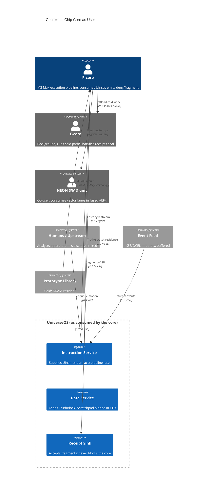
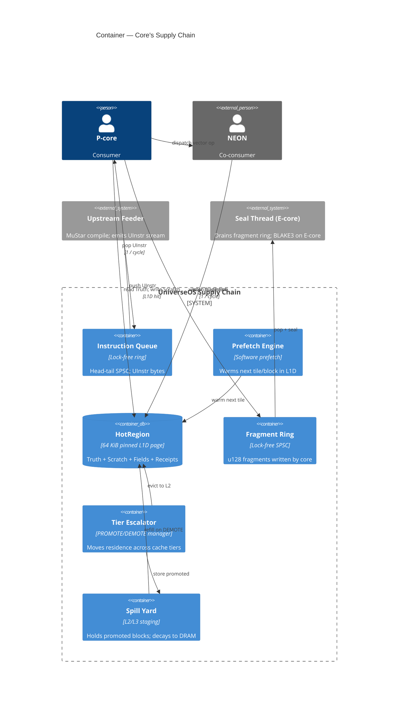
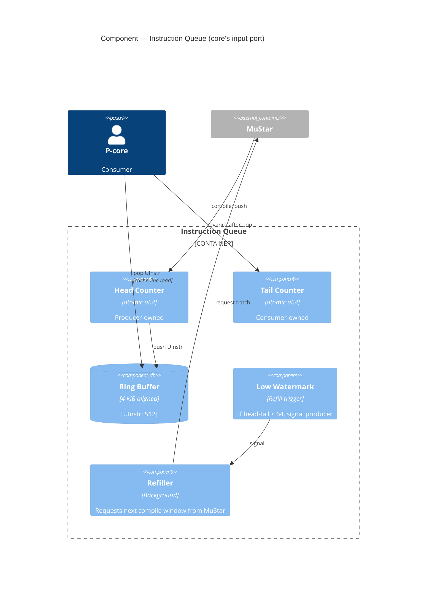
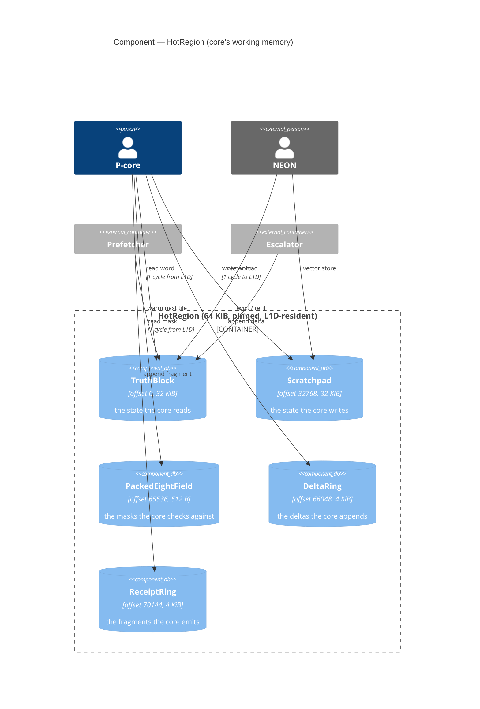
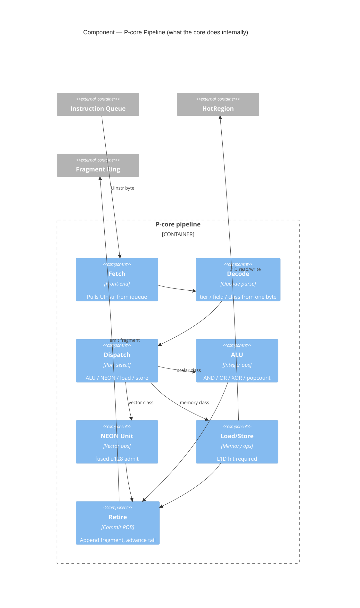
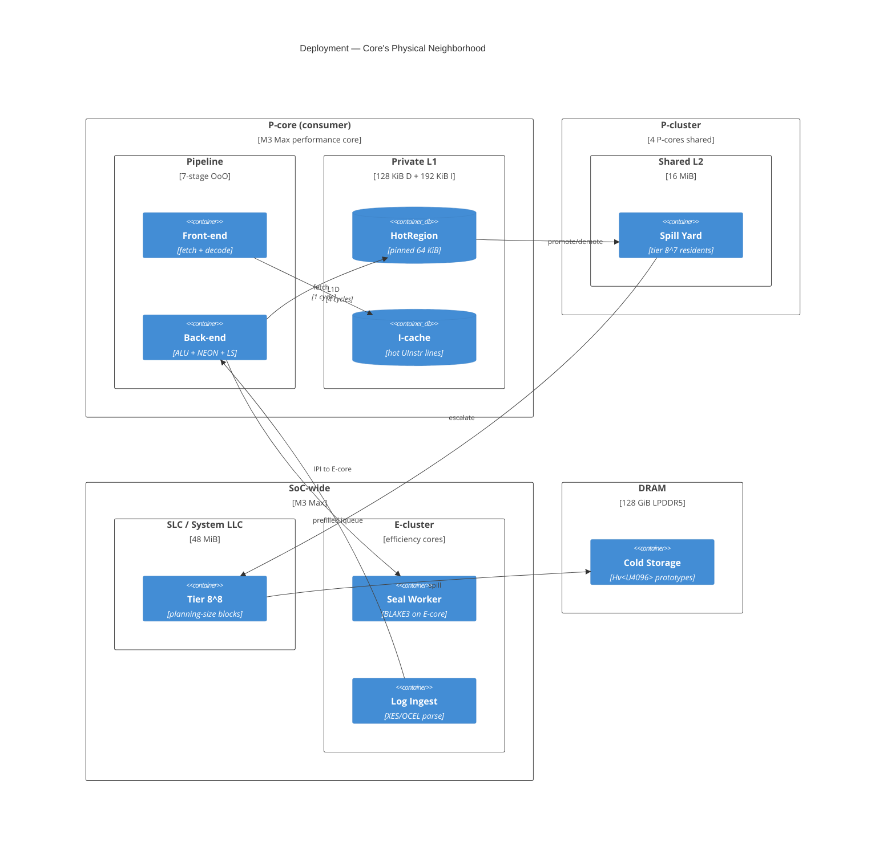
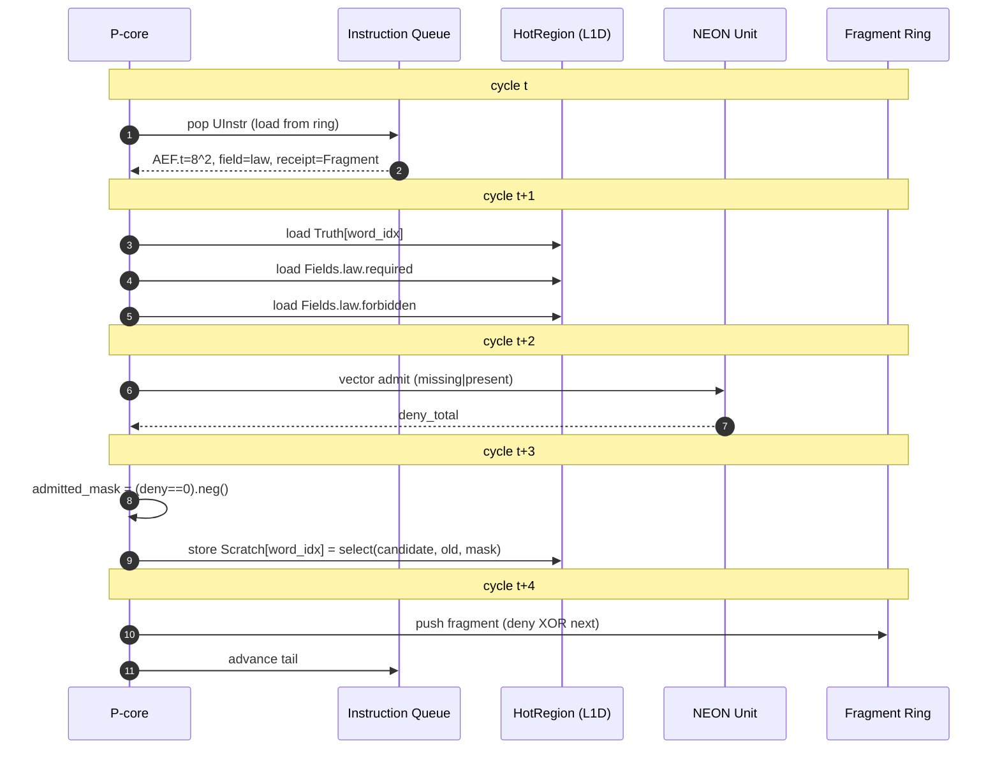
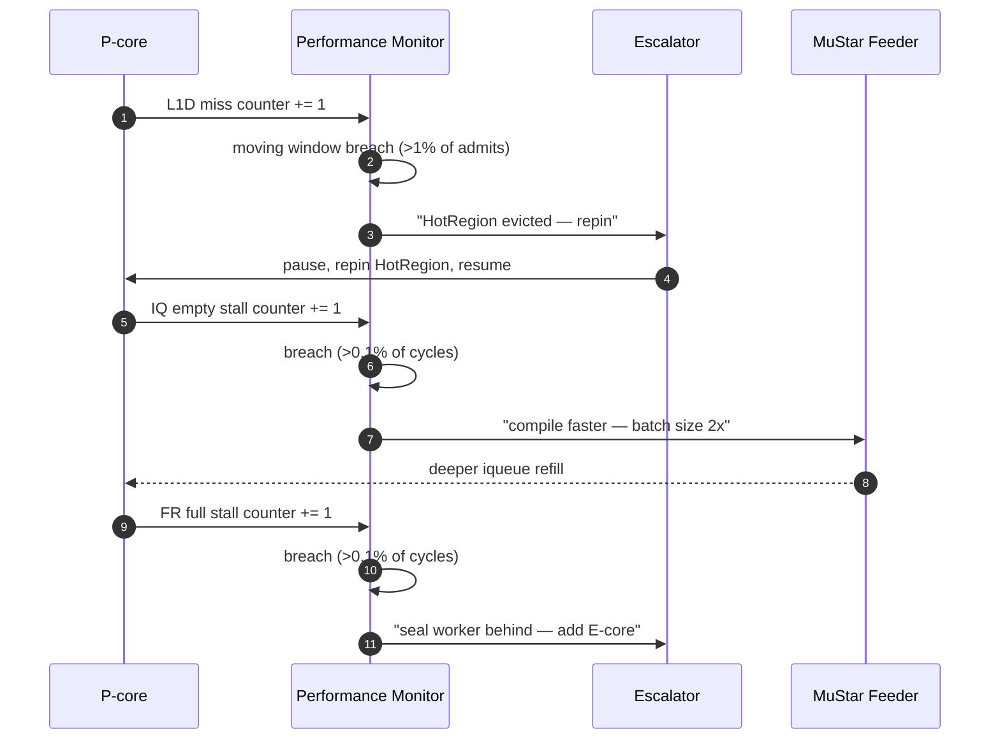

# 42 — C4 From the Chip Core's Perspective

## The inversion

Doc 41 drew C4 with humans as users. That is the conventional view.

The kinetic view: **the chip core is the user**. Humans, logs, and
motion packets are all upstream suppliers feeding the core. The core
consumes instructions and emits receipts. UniverseOS is the service the
core calls; everything else is the core's vendor chain.

The Pragmatic question this answers: *what does the core need, in what
order, at what rate, from what residence?*

---

## C4-L1 — Context (core as user)



**Read it as:** the P-core is the paying customer. Humans are suppliers
three tiers removed. The contract UniverseOS signs with the core is:
deliver one typed instruction per cycle, keep Truth/Scratch resident,
accept fragments without backpressure.

---

## C4-L2 — Container (the core's supply chain)



**The contract:** every container on the core's side of the bus is
lock-free, bounded, and non-blocking. If the instruction queue empties,
the core stalls — that is the producer's fault (MuStar compile is too
slow). If the fragment ring fills, the core drops or blocks — that is
the sink's fault (seal thread is too slow). Both are visible as counters.

---

## C4-L3a — Component: The Instruction Queue



**Pragmatic invariant:** the core never waits on a lock. The ring's size
(512 entries = 4 KiB, one cache line of entries per 64 bytes) is sized
so the head/tail separation survives one producer compile pass.

---

## C4-L3b — Component: The HotRegion (core's working memory)



**The geometry:** the core sees exactly one page, always at the same
virtual address, always pinned, always warm. Every offset within that
page has semantic meaning; position validation runs at pin time. The
core never reads cold memory on the hot path.

---

## C4-L3c — Component: The Core's Own Pipeline



**Pragmatic lens:** the core is a 7-stage pipeline that wants one fused
admit-commit-emit superop per cycle. Anything that causes a dispatch
stall (cache miss, branch misprediction, NEON port contention) is
visible in Instruments. Those are the metrics that matter — not wall
clock.

---

## C4 — Deployment (core's physical world)



**The budget:**
```
front-end -> L1D hit      5 cycles round-trip
fused AEF.t              10 cycles (pipelined, 1 retire/cycle amortized)
fragment write            1 cycle
```

If the core achieves ~1 admitted motion per 10 cycles at 3 GHz, that is
**300 M admissions/sec per P-core**. Four P-cores synchronized = 1.2 B/s
peak. This is the target.

---

## C4 — Dynamic: One Cycle (the core's perspective)



**Five cycles end-to-end.** Fully pipelined: five instructions all in
flight, one retiring each cycle, so throughput is **one admission per
cycle** at steady state.

---

## C4 — Dynamic: Core's Complaint Path



**The core complains in counters, not logs.** The Performance Monitor
reads counters every ~1 M cycles, applies thresholds, and issues
repairs. This is the feedback loop that keeps the core fed, warm, and
unblocked.

---

## The Pragmatic reframing

Doc 41 was the architect's view: *how do humans use this?*
Doc 42 is the core's view: *how does the core get what it needs?*

Both must be true. They are the same system from two ends of the
supply chain.

| View | Upstream | Downstream |
|---|---|---|
| Human-as-user (doc 41) | human intent | sealed artifacts |
| Core-as-user (doc 42)  | UInstr stream | retired fragments |

When the two views agree — when humans' intent arrives as UInstr at the
core's rate, and the core's fragments roll up to humans' receipts — the
supply chain is balanced.

---

## The sentence

**From the core's perspective, UniverseOS is a supply chain that must
deliver one typed instruction per cycle, keep the 64 KiB HotRegion
pinned in L1D, and accept a 128-bit fragment per cycle without
backpressure — and every architectural decision is a clause in that
contract, not a feature for humans.**
