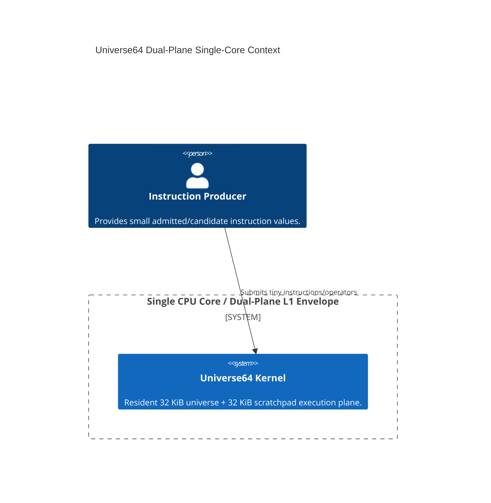
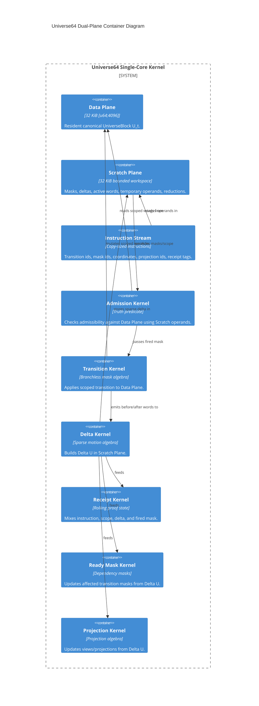
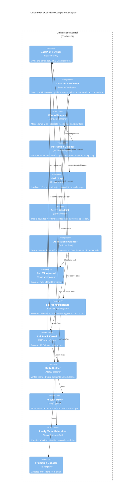

# C4 Documents — Universe64 Single-Core Dual-Plane L1 Architecture

## Scope
This C4 model describes **Universe64 running inside one CPU core** using the **Dual-Plane L1 execution model**:
- **Plane_D (Data Plane):** 32 KiB resident state (`UniverseBlock = [u64; 4096]`).
- **Plane_S (Scratch Plane):** 32 KiB workspace (masks, active-word sets, deltas, staging).

## The Core Law
> **The data plane stays resident. The scratch plane receives operators, masks, and temporary motion state.**

## C1 — System Context

## C2 — Container Diagram

## C3 — Component Diagram

## Timing Constitution
- **T0 (Primitive):** $\le 2\text{ns}$ (Masks, Selects).
- **T1 (Microkernel):** $\le 200\text{ns}$ (Cell/Sparse Transitions, Delta building).
- **T2 (Orchestration):** $\le 5\mu\text{s}$ (Full-block scan, Hamming distance).
- **T3 (Epoch):** $\le 100\mu\text{s}$ (System synthesis, cryptographic hashing).

## Implementation Rules
1. **Instructions move, not data:** The kernel receives tiny operator IDs, not 32 KiB payloads.
2. **Delta is the event:** Output is $\Delta U = U_t \oplus U_{t+1}$ and a rolling `UReceipt`.
3. **No branches (CC=1):** Transition admissibility must be computed via bitwise mask logic.
4. **No heap:** All staging must fit inside the 32 KiB `Plane_S`.
