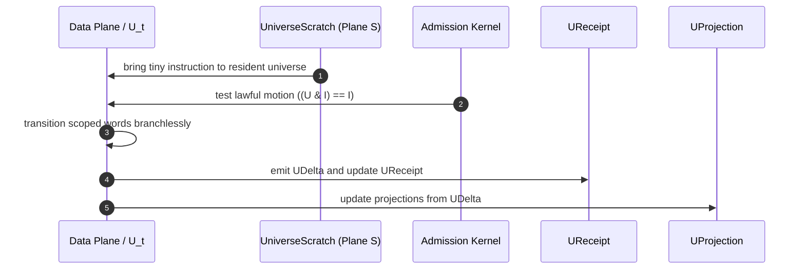
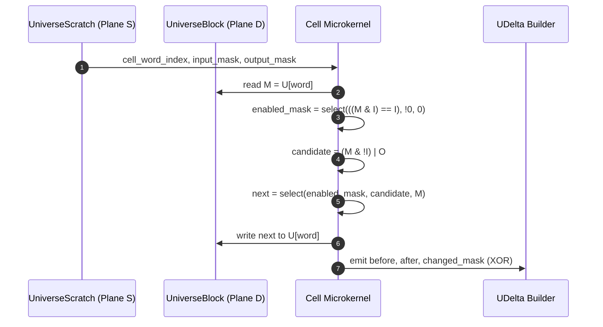
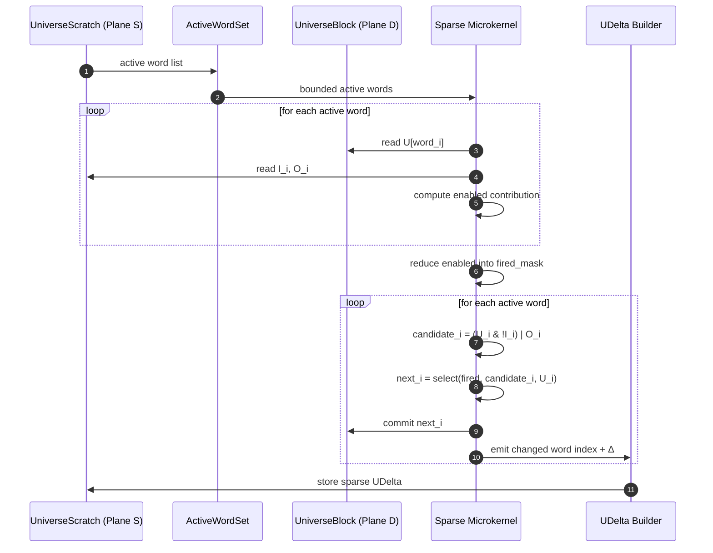
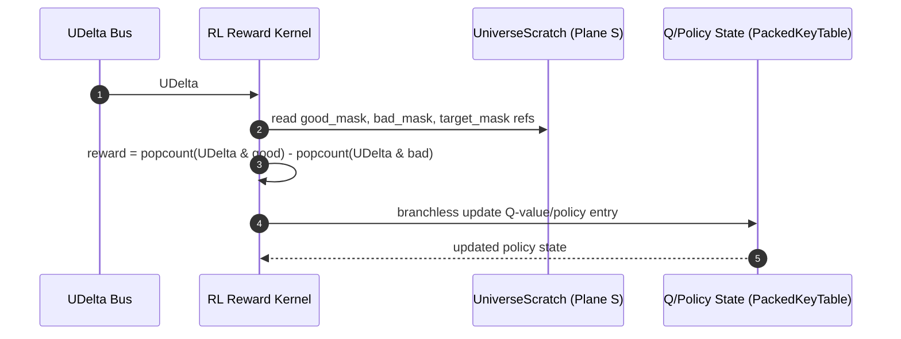
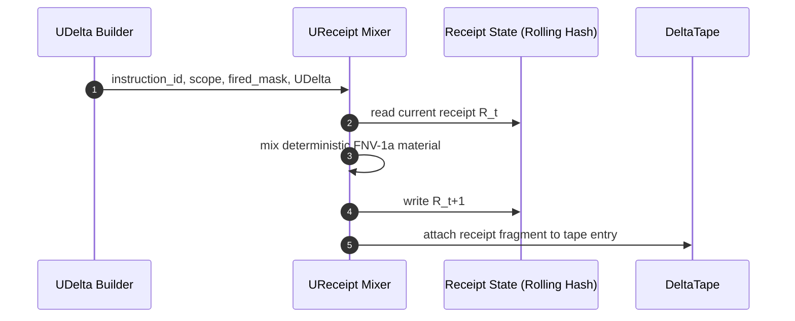

# UniverseOS Sequence Diagrams — Subsystem Interaction Reference

## 1. Core Law Sequence
[U_t stays resident. Instructions move. Deltas emit. Receipts remember.]

## 2. Cell-Level Petri64 Transition (T1)

## 3. Sparse Multi-Word Transition (T1)

## 4. Deterministic RL Update from UDelta

## 5. Substrate Integrity Receipt (Hot Path)

## Subsystem Index
| Subsystem | Diagrams |
| :--- | :--- |
| **Execution** | Core Law (1), Cell Transition (2), Sparse Transition (3) |
| **Reinforcement** | RL Reward Update (4) |
| **Provenance** | Receipt Hot Path (5) |
| **Orchestration** | Full-Block T2 Scan (See `U64_ARCHITECTURE.md`) |
